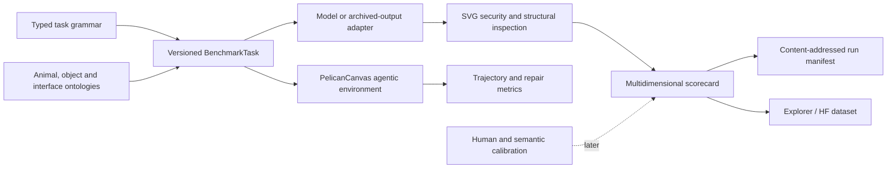

# PelicanBench

**PelicanBench** is a longitudinal, compositional and agentic visual-generation benchmark anchored by the deceptively difficult task of depicting a pelican riding a bicycle.

It turns a memorable model demonstration into a reproducible research programme. The benchmark evaluates not only the selected final picture, but also source integrity, anatomy, mechanics, interaction geometry, editability, repair, tool use, trajectories, calibration, cost, stability and learning. The public pelican-on-a-bike prompt remains the heritage anchor; the scientific benchmark uses dynamic animals, mobile non-living objects and interaction relations to resist prompt-specific optimisation.

> **Status:** `v0.1.0-alpha.1` implements the V1 MVP: typed tasks and ontologies, deterministic task generation, bounded SVG inspection, multidimensional structural scoring, corpus NLP fixtures, longitudinal metrics, a reproducible runner, PelicanCanvas, trajectory and repair metrics, adversarial fixtures, Hub-ready assets, Conductor tracks and CI. Human calibration, rights-cleared historical ingestion, live provider runs and production agentic-application adapters remain explicit follow-on work.

## Why this exists

Simon Willison has repeatedly used “a pelican riding a bicycle” as a compact test of LLM-generated SVG capability. Dylan Mordaunt subsequently explored the same problem through agentic drawing and argued that the attempts, feedback loops and contact sheets reveal more than a single selected image. PelicanBench preserves that history while expanding it into a dynamic benchmark that can ask whether systems:

- recognise and construct the right animal and mobile object;
- create a mechanically and anatomically coherent interaction;
- generate safe, editable artifacts rather than visual shortcuts;
- diagnose and repair defects without damaging correct regions;
- use drawing tools iteratively, recover from mistakes and learn within governed boundaries; and
- remain reproducible as models, judges and benchmarks change.

## V1 MVP



Run the deterministic fixture benchmark:

```bash
uv sync --all-extras
uv run pelicanbench validate-repo
uv run pelicanbench generate-tasks --count 12 --seed 20260801 --output runs/tasks.jsonl
uv run pelicanbench run-fixture --output runs/fixture
uv run pytest
```

The same commands work with `python -m pelicanbench.cli` after installing the package.

## Benchmark tracks

The scorecard separates the **Heritage SVG**, **Compositional SVG**, **Direct Image**, **Reference-Grounded**, **Repair**, **Agentic Drawing** and **Human-in-the-Loop** tracks. Direct generators, code-generating models and tool-using agents are not collapsed into one leaderboard.

V1 is deliberately an MVP. It is useful on its own and establishes stable contracts, but it does not pretend to have completed rights negotiations, human validation, model-wide evaluation or hardened production infrastructure. Evidence-backed progress is recorded in [`conductor/status.md`](conductor/status.md).

## Conductor and agent workflow

The repository vendors a workspace-local Conductor plugin at [`.agents/plugins/conductor`](.agents/plugins/conductor), mirrors its callable skills at [`.agents/skills`](.agents/skills), and stores the project context, specifications and plans under [`conductor/`](conductor/). Every programme track has a parent GitHub issue and four phase issues in the generated issue manifest.

The development contract is:

1. Context and decision record.
2. Specification with MoSCoW requirements and Mermaid design.
3. Test-first phased plan.
4. Small implementation commits with evidence.
5. Review, threat-model and reproducibility checks.
6. Governed learning proposals, never automatic benchmark mutation.

## Provenance

Entire is configured from the first repository revision through [`.entire/settings.json`](.entire/settings.json). Entire captures development-session provenance on its checkpoint branch; benchmark execution separately emits immutable run manifests. These are complementary, not interchangeable.

## Ecosystem

PelicanBench is designed to interoperate with Dylan Mordaunt’s repositories rather than duplicate them. Integration boundaries are documented for `krita-cli`, `sourceright`, `authentext`, `open_social_data`, `osf-cli-go`, `entireio-cli`, `arxiv-paper-template` and related archival/research tooling. Optional adapters degrade cleanly when sibling repositories are absent.

## Governance and citation

See [`GOVERNANCE.md`](GOVERNANCE.md), [`SECURITY.md`](SECURITY.md), the benchmark/data/scorer cards under [`docs/`](docs/), and [`CITATION.cff`](CITATION.cff). Historical text and images are not redistributed merely because they are publicly visible; the rights ledger determines what can be mirrored, transformed or linked.

Licensed under Apache-2.0. Third-party source materials retain their own rights.
