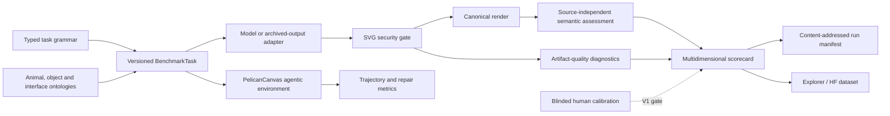

# PelicanBench

**PelicanBench** is a longitudinal, compositional and agentic visual-generation benchmark anchored by the deceptively difficult task of depicting a pelican riding a bicycle.

It turns a memorable model demonstration into a reproducible research programme. The benchmark evaluates not only the selected final picture, but also source integrity, anatomy, mechanics, interaction geometry, editability, repair, tool use, trajectories, calibration, cost, stability and learning. The public pelican-on-a-bike prompt remains the heritage anchor; the scientific benchmark uses dynamic animals, mobile non-living objects and interaction relations to resist prompt-specific optimisation.

> **Status:** `v0.2.0-alpha.1` is the measurement-validity alpha. It separates source, render and semantic evidence; removes author-controlled SVG labels from normative semantic scoring; introduces stable scenario, prompt, condition, trial and evaluation identities; prespecifies a 33-task affordance-stratified pilot; and emits interoperable research-object provenance. It is E2 fixture-verified, not yet human-calibrated or independently reproduced.

## Why this exists

Simon Willison has repeatedly used “a pelican riding a bicycle” as a compact test of LLM-generated SVG capability. Dylan Mordaunt subsequently explored the same problem through agentic drawing and argued that the attempts, feedback loops and contact sheets reveal more than a single selected image. PelicanBench preserves that history while expanding it into a dynamic benchmark that can ask whether systems:

- recognise and construct the right animal and mobile object;
- create a mechanically and anatomically coherent interaction;
- generate safe, editable artifacts rather than visual shortcuts;
- diagnose and repair defects without damaging correct regions;
- use drawing tools iteratively, recover from mistakes and learn within governed boundaries; and
- remain reproducible as models, judges and benchmarks change.

## V1 MVP



Run the deterministic fixture benchmark after installing the package and development dependencies:

```bash
python -m pip install -e '.[dev,analysis]'
pelicanbench validate-repo
pelicanbench generate-v1-pilot
pelicanbench release-readiness --profile v0.2-alpha
pelicanbench scorer-challenges \
  --source benchmark/fixtures/svg/pelican-bicycle-valid.svg \
  --output artifacts/scorer-challenge-report.json
pelicanbench run-fixture --output runs/fixture
bash scripts/harness.sh
```

`uv` remains the intended environment manager. The alpha deliberately does not include a fabricated or incomplete lockfile; see [`docs/reproducible-environments.md`](docs/reproducible-environments.md).


## Measurement validity

The original structural prototype could be gamed by placing semantic words in SVG IDs or invisible elements. `svg-multilayer/0.2.0` treats those labels as diagnostic only. Animal, object and interaction scores require a source-independent assessment of the canonical render. The exploit and its regression tests remain public under [`benchmark/scorer-challenges`](benchmark/scorer-challenges).

Release claims are evaluated against the machine-readable [`benchmark/assurance-case.json`](benchmark/assurance-case.json) and [`conductor/release-blockers.json`](conductor/release-blockers.json).

## Benchmark tracks

The scorecard separates the **Heritage SVG**, **Compositional SVG**, **Direct Image**, **Reference-Grounded**, **Repair**, **Agentic Drawing** and **Human-in-the-Loop** tracks. Direct generators, code-generating models and tool-using agents are not collapsed into one leaderboard.

V1 is deliberately narrow: a prospective, human-calibrated one-shot SVG benchmark. Repair, agentic drawing, accessibility and future media remain separate follow-on tracks. The current alpha establishes fixture-verified contracts but does not claim empirical model rankings. Evidence-backed progress is recorded in [`conductor/status.md`](conductor/status.md).

## Conductor and agent workflow

The repository vendors a workspace-local Conductor plugin at [`.agents/plugins/conductor`](.agents/plugins/conductor), mirrors its callable skills at [`.agents/skills`](.agents/skills), and stores the project context, specifications and plans under [`conductor/`](conductor/). Every programme track is specified as one parent GitHub issue and four phase issues, with five cross-track release blockers. The deterministic manifest therefore defines 115 work items; authenticated synchronization creates and updates that hierarchy idempotently.

The development contract is:

1. Context and decision record.
2. Specification with MoSCoW requirements and Mermaid design.
3. Test-first phased plan.
4. Small implementation commits with evidence.
5. Review, threat-model and reproducibility checks.
6. Governed learning proposals, never automatic benchmark mutation.

## Provenance

Entire is configured from the first repository revision through [`.entire/settings.json`](.entire/settings.json). Entire captures development-session provenance on its checkpoint branch; benchmark execution separately emits immutable run manifests, W3C PROV JSON-LD, RO-Crate metadata and reproduction commands. These are complementary, not interchangeable.

## Ecosystem

PelicanBench is designed to interoperate with Dylan Mordaunt’s repositories rather than duplicate them. Integration boundaries are documented for `krita-cli`, `sourceright`, `authentext`, `open_social_data`, `osf-cli-go`, `entireio-cli`, `arxiv-paper-template` and related archival/research tooling. Optional adapters degrade cleanly when sibling repositories are absent.

## Governance and citation

See [`GOVERNANCE.md`](GOVERNANCE.md), [`SECURITY.md`](SECURITY.md), the benchmark/data/scorer cards under [`docs/`](docs/), and [`CITATION.cff`](CITATION.cff). Historical text and images are not redistributed merely because they are publicly visible; the rights ledger determines what can be mirrored, transformed or linked.

Licensed under Apache-2.0. Third-party source materials retain their own rights.
