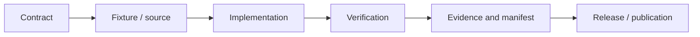

# T00: Foundation, governance and Conductor

## Overview

Establish the repository constitution, Conductor lifecycle, decision records, Git/Entire provenance and single-developer operating model.

## Why this track exists

This track is a separately testable capability in the PelicanBench programme. It must remain usable for the V1 MVP while preserving a path to calibrated and hardened research infrastructure.

## MoSCoW requirements

### Must

- Define versioned inputs, outputs and acceptance evidence.
- Preserve rights, security, provenance and sealed-set boundaries.
- Include deterministic fixtures or an explicit externally blocked state.
- Link implementation evidence, tests and GitHub phase issues.

### Should

- Expose an implementation-independent interface.
- Quantify uncertainty, failure modes and comparability impact.
- Integrate with the shared ontology, manifest and registry contracts.

### Could

- Add experimental Rust, Mojo, WASM, OpenEnv or live-provider backends.
- Support public visualisation and scholarly outputs.

### Won't in V1

- Claim maturity without independent validation.
- Redistribute rights-restricted historical material.
- Allow agents to autonomously alter normative scoring from sealed results.

## Acceptance criteria

- P0 documents contracts, options, recommendation, decision and risks.
- P1 produces an executable or inspectable vertical slice.
- P2 demonstrates validation, adversarial or reproducibility evidence.
- P3 meets stable-release security, performance, migration and operational gates.

## Architecture

## Dependencies

Shared schema and provenance contracts in T02; governance and workflow in T00; release/drift policy in T20.

## Out of scope

Unreviewed production claims, hidden paid execution and silent changes to public benchmark meaning.
