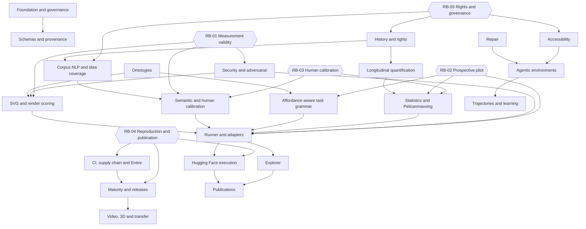

# Programme map

V1 is the narrow empirical slice through T00, T02, T03, T06, T07, T08, T09, T10, T11, T12, T17 and T20. Repair and agentic drawing remain V1.x tracks rather than enlarging the initial claim. The five release blockers cut across capability tracks and prevent fixture completion from being mistaken for empirical or operational maturity.
