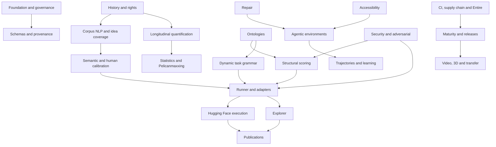

# Programme map

V1 is the smallest coherent slice through T00, T02, T03, T06, T08, T10, T12 and T15, with prototype evidence in adjacent tracks. The roadmap does not require the entire future stack before the benchmark can release an MVP.
