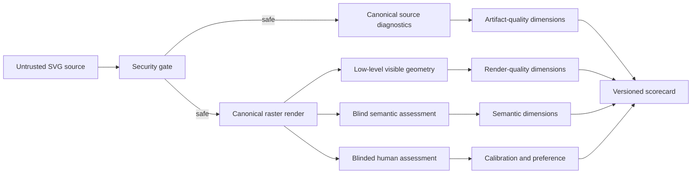

# Source, render and semantic evidence contract

## Purpose

PelicanBench must score what an artifact visibly depicts, not what its author claims that
it depicts. SVG identifiers, classes, comments and metadata are therefore untrusted
submission-controlled data.

## Evidence firewall

### Source security channel

Permitted evidence includes XML validity, prohibited elements, external resources,
resource bounds, embedded raster use and path complexity. This channel determines whether
an artifact may be rendered and evaluated. It does not determine animal recognition,
object recognition or relation correctness.

### Artifact-quality channel

Permitted evidence includes grouping, editability, portability, transform complexity and
source size. Declared labels may be reported descriptively to study editability, but they
are never semantic ground truth.

### Render channel

The canonical renderer produces an aspect-preserving square RGBA image composited on an
opaque white canvas and a hash of those visible pixels. Visible geometry, component masks
and spatial descriptors may contribute to composition and render diagnostics. Invisible,
transparent, definition-only and known off-canvas elements are excluded. The opaque
background prevents viewer-dependent transparency colours from changing the artifact
identity.

### Semantic channel

Animal, object, feature, interaction and instruction scores require a
`SemanticAssessment` that:

- references the exact task;
- references the exact canonical render hash;
- declares that its evidence is source-independent;
- answers versioned atomic visual questions; and
- records judge identity, revision and calibration version.

No semantic assessment means no semantic credit. Fixture assessors exist only for
conformance tests and are labelled `fixture-only`.

## Required metamorphic invariants

- Renaming or deleting IDs, classes, comments and ARIA labels leaves rendered and semantic
  scores unchanged.
- Adding invisible, fully transparent, definition-only or off-canvas labelled geometry
  cannot increase a score.
- Reordering independent source elements cannot change semantic scores.
- Equivalent visible geometry expressed with different SVG primitives should produce
  comparable render-derived results.
- A semantic assessment for one render hash cannot be reused for another render.
- Rendered prompt injection is treated as an adversarial visual input and must be included
  in judge calibration and scorer challenges.

## Known limits

Canonical rasterisation can vary across renderers, fonts and unsupported SVG features.
The CairoSVG implementation is normative for v0.2 alpha. Inkscape is an aspect-preserving
bridge renderer on the same opaque white canvas. The fixture bridge currently produces
identical canonical pixels, but broader feature and font coverage remains required. V1
requires a documented bridge study and human-calibrated semantic evidence.
