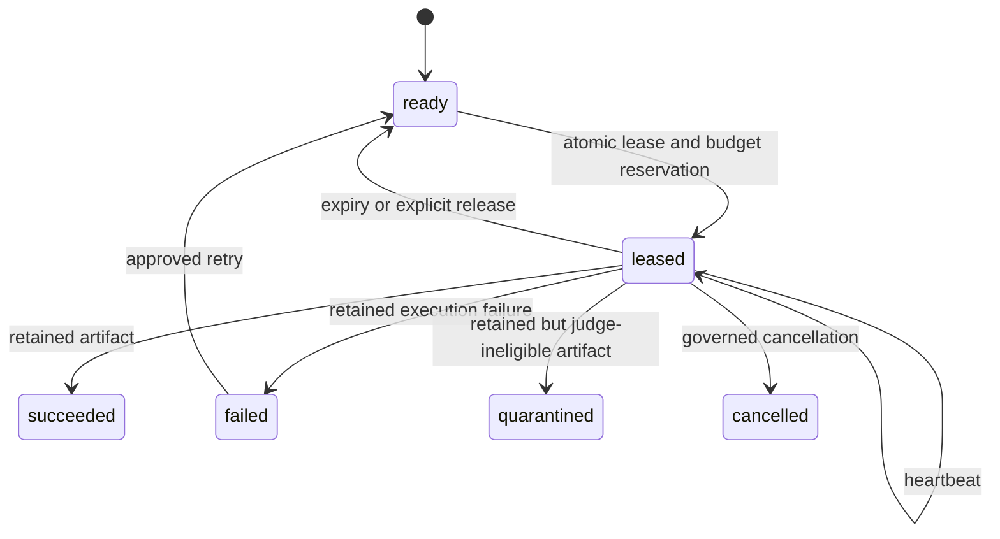

# Transactional campaign store

## Purpose

The prospective benchmark can contain thousands of model-task-replicate cells. A plain
JSONL ledger is useful for interchange, but it cannot safely allocate work to concurrent
workers. PelicanBench therefore provides a SQLite reference store with atomic leases,
budget reservation, expiry, recovery and hash-chained event export.

The store is the normative single-host and shared-filesystem implementation. It is not a
claim that SQLite is suitable for globally distributed scheduling. A different database
may be used only when it implements the same transition, ownership, budget and audit
contracts.

## State and ownership model

A lease contains a cryptographically random ownership token by default. Fixture code may
inject a deterministic token factory, but production execution must not use predictable
lease tokens. Completion and heartbeat operations require the cell identifier, worker
identifier and token. Expired or foreign leases fail closed.

## Atomicity and concurrency

Leasing uses an immediate SQLite transaction. Inside the transaction PelicanBench:

1. verifies the immutable campaign manifest;
2. reclaims expired leases;
3. calculates actual and reserved cost;
4. calculates active leases per model;
5. selects eligible ready cells in deterministic order;
6. reserves each cell and emits its event before committing; and
7. rolls back the complete transaction on any failure.

This prevents duplicate allocation, model-concurrency breaches and partial event writes.
Concurrency tests use independent connections and demonstrate that competing workers do
not receive the same cell.

## Cost treatment

Estimated cost is reserved while a cell is leased. Actual cost is added when the lease is
completed. A cell with an unknown estimate cannot be leased. The hard budget is checked
against spent plus reserved cost, so parallel workers cannot independently spend the same
remaining balance.

Provider invoices remain the authoritative financial source. The store provides a
reproducible operational account that must be reconciled against provider records.

## Audit and reconciliation

Every transition is domain-separated and content-addressed. Event rows retain their
previous event hash, producing an append-only chain. Reconciliation independently checks:

- manifest identity;
- event sequence and hash continuity;
- replayed versus stored cell states;
- replayed versus stored cost;
- lease ownership and expiry invariants; and
- consistency between terminal states and artifacts.

The JSONL export is deterministic and portable. Mutation of an immutable event column is
detected even when the database remains structurally valid.

## Evidence status

The reference store is E2 fixture-verified. The current evidence includes atomic
multi-worker tests, lease expiry, heartbeat, requeue, budget reservation, token-collision
rollback, tamper detection and deterministic event export. Live provider load testing,
networked database conformance and independent operational reproduction remain required
for higher maturity.

## Worker liveness and immutable attempts

A live worker renews its lease while a blocking provider call is in progress. Renewal uses
`max(current expiry, heartbeat time + lease duration)`. It does not add a complete lease
duration to the existing expiry on every heartbeat, so a rapid heartbeat loop cannot move
ownership arbitrarily far into the future.

Every leased attempt produces a separate content-addressed execution record. A retry uses a
new attempt number and cannot overwrite the failed attempt that preceded it. Workers write:

- run artifacts under `cells/<cell-id>/attempt-<n>/`;
- immutable records under `execution-records/<cell-id>/`;
- content-addressed batch receipts under `worker-batches/<worker-id>/`; and
- no shared read-modify-write index during concurrent execution.

The portable execution index is generated after or during supervision by scanning and
verifying immutable records. Reconciliation joins each worker terminal event to exactly one
record using the cell identifier, lease token and attempt number, then verifies state,
reason, cost and artifact identity. Missing, duplicate, orphaned or modified records fail
the reconciliation gate.
